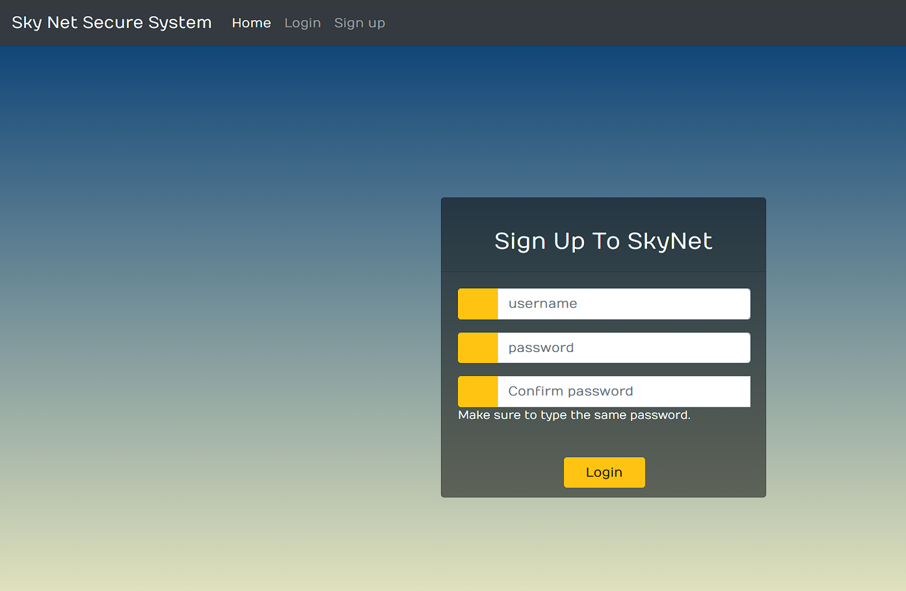
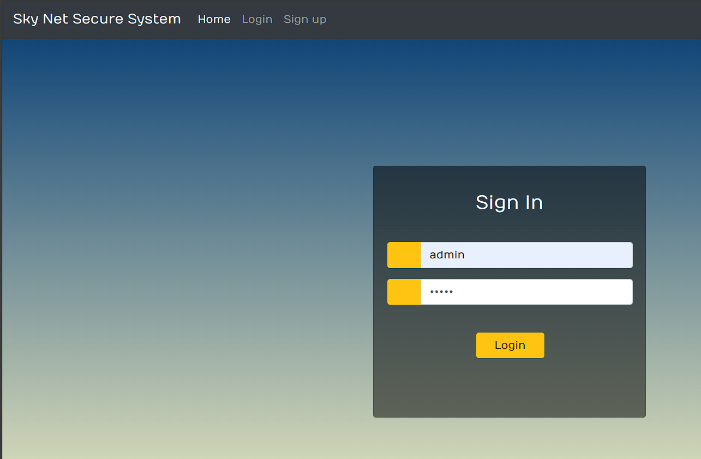
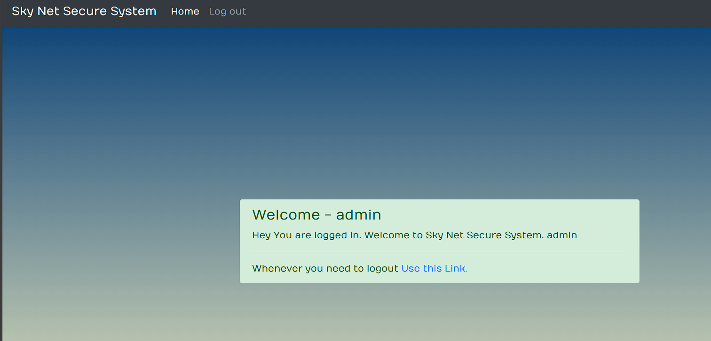

# SkyNetLogin
<big>
This is a web page application which allows users to create a username and password. 
This is a PHP code which enters the data from the Sign Up page and enters it into the database. 
If the username and password exist then you will get a message that the user with the particular name exists. 
The database will not save the passwords of users it will hash them and store them.  
Thus preventing any kind of malicious and unauthorised access to the user's details. 
The user will go to the Welcome Page as soon as the user logs into the site. 
Technologies Used: Html, CSS, Bootstrap 4, Mysql, Php. 
  <table>
  <tr>
    <td></td>
     <td></td>
    <tr>
      <td></td>
  </tr>
</big>
